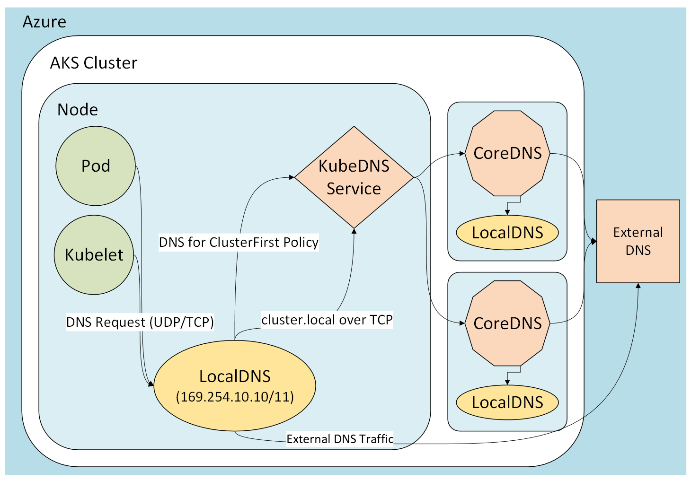

# AKS 클러스터 LocalDNS Adoption 전략 및 가이드

## 목차

- [개요](#개요)
- [기존 AKS 클러스터의 DNS Resolution 방식과 문제](#기존-aks-클러스터의-dns-resolution-방식과-문제)
  - [기본 DNS 아키텍처: CoreDNS 중앙 집중형 모델](#기본-dns-아키텍처-coredns-중앙-집중형-모델)
  - [클러스터 규모 확장 시 발생하는 문제](#클러스터-규모-확장-시-발생하는-문제)
- [LocalDNS와 도입 효과](#localdns와-도입-효과)
  - [LocalDNS란?](#localdns란)
  - [기존 문제 해결](#기존-문제-해결)
  - [성능 비교 (10,000 QPS 부하 테스트)](#성능-비교-10000-qps-부하-테스트)
  - [기타 운영상 이점](#기타-운영상-이점)
- [테스트 환경 구성 및 검증](#테스트-환경-구성-및-검증)
- [도입 가이드](#도입-가이드)
  - [사전 요구사항](#사전-요구사항)
  - [Step 1: 설정 파일 작성](#step-1-설정-파일-작성)
  - [Step 2: 노드 풀에 LocalDNS 활성화](#step-2-노드-풀에-localdns-활성화)
  - [Step 3: 동작 확인](#step-3-동작-확인)
  - [Step 4: 비활성화 (필요 시)](#step-4-비활성화-필요-시)
  - [주의사항](#주의사항)
- [참고자료](#참고자료)

## 개요

본 문서는 AKS 클러스터에서 기본 DNS 서비스인 CoreDNS의 중앙 집중형 아키텍처가 프로덕션 규모에서 드러내는 한계를 분석하고, 이를 해결하기 위한 **LocalDNS** 도입을 제안합니다. LocalDNS의 동작 원리와 기대 효과를 설명하며, Azure CLI 기반의 구성 가이드를 함께 제공합니다.

---

## 기존 AKS 클러스터의 DNS Resolution 방식과 문제

### 기본 DNS 아키텍처: CoreDNS 중앙 집중형 모델

AKS 클러스터에서는 **CoreDNS**가 기본 DNS 서비스로 동작합니다. CoreDNS는 `kube-system` 네임스페이스에 Deployment로 배포되며, 클러스터 내 모든 워크로드의 DNS 쿼리를 중앙에서 처리합니다.

CoreDNS Pod 수는 `coredns-autoscaler` ConfigMap의 `ladder` 설정에 따라 클러스터 규모에 비례하여 자동 조정됩니다. 두 기준(코어 수, 노드 수) 중 **더 큰 레플리카 값**이 적용됩니다.

```yaml
# coredns-autoscaler ConfigMap 기본값 (kube-system)
ladder: '{"coresToReplicas":[[1,2],[512,3],[1024,4],[2048,5]],
  "nodesToReplicas":[[1,2],[8,3],[16,4],[32,5]]}'
```

| 기준             | 조건                      | CoreDNS Pod 레플리카 |
| ---------------- | ------------------------- | -------------------- |
| **코어 수 기준** | 1+ / 512+ / 1024+ / 2048+ | 2 / 3 / 4 / 5개      |
| **노드 수 기준** | 1+ / 8+ / 16+ / 32+       | 2 / 3 / 4 / 5개      |

> [!NOTE]
> 두 기준의 결과 중 `max` 값이 최종 레플리카 수로 결정됩니다.  
> 예: 노드 4개(→2개) + 코어 600개(→3개) = **최종 3개**

즉, 기본 설정 기준으로 CoreDNS Pod은 **최소 2개에서 최대 5개**까지 배포됩니다. 클러스터 내 모든 워크로드의 DNS 쿼리가 이 소수의 Pod에 집중되는 구조입니다.

```
┌──────────┐     ┌──────────┐     ┌──────────┐
│  Pod A   │     │  Pod B   │     │  Pod C   │
│ (Node 1) │     │ (Node 1) │     │ (Node 2) │
└────┬─────┘     └────┬─────┘     └────┬─────┘
     │                │                │
     └───────┬────────┘                │
             │    ┌────────────────────┘
             ▼    ▼
     ┌──────────────────┐
     │  CoreDNS Pods    │  ◀── kube-system 네임스페이스
     │  (기본 2~5개)     │     (클러스터 전체 DNS 쿼리 처리)
     └───────┬──────────┘
             │
             ▼
     ┌──────────────────┐
     │  Upstream DNS    │  ◀── Azure DNS / 외부 DNS
     └──────────────────┘
```

DNS 쿼리 흐름을 정리하면 다음과 같습니다.

1. Pod에서 DNS 쿼리 발생 (예: 다른 서비스 이름 resolve)
2. 쿼리가 **네트워크를 통해** CoreDNS Pod으로 전달
3. CoreDNS가 캐시 확인 후, 필요 시 Upstream DNS 서버로 포워딩
4. 응답이 다시 네트워크를 거쳐 요청 Pod으로 반환

### 클러스터 규모 확장 시 발생하는 문제

중앙 집중형 CoreDNS 아키텍처에서는 클러스터 규모가 커질수록 다음과 같은 문제가 발생할 수 있습니다.

| 문제                      | 원인                                                                   | 발생 가능한 결과                                 |
| ------------------------- | ---------------------------------------------------------------------- | ------------------------------------------------ |
| **트래픽 편중**           | UDP 프로토콜 특성상 트래픽이 단일 CoreDNS Pod에 집중                   | 특정 Pod 리소스 소진 → DNS 응답 지연 및 실패     |
| **conntrack 테이블 소진** | 모든 DNS 쿼리가 conntrack 항목을 생성하며, UDP 항목은 기본 30초간 유지 | 패킷 드롭, 커넥션 거부 → 네트워크 통신 장애      |
| **네트워크 홉 지연**      | 반복되는 동일 쿼리도 매번 네트워크를 거쳐 CoreDNS Pod으로 전달         | 노드-로컬 캐시 활용 불가 → 애플리케이션 타임아웃 |
| **Cross-AZ 통신 지연**    | CoreDNS Pod이 다른 AZ에 위치할 경우 DNS 쿼리가 AZ 간 네트워크를 경유   | AZ 간 추가 지연 발생 → DNS 응답 시간 증가        |
| **장애 전파**             | CoreDNS Pod 과부하 또는 장애 시 모든 서비스 디스커버리에 영향          | 클러스터 전체 장애로 확대 가능                   |

이처럼 중앙 집중형 CoreDNS 구조는 **프로덕션 규모로 확장될 때 근본적인 아키텍처 한계**를 드러내게 됩니다. 이 문제들을 근본적으로 해결하기 위해, 본 문서에서는 AKS의 노드-레벨 DNS 프록시 기능인 **LocalDNS** 도입을 제안합니다.

---

## LocalDNS와 도입 효과

### LocalDNS란?

LocalDNS는 AKS 각 노드에 `systemd` 서비스로 배포되는 **노드-레벨 DNS 캐싱 프록시**입니다. Kubernetes 커뮤니티의 [NodeLocal DNSCache](https://kubernetes.io/docs/tasks/administer-cluster/nodelocaldns/)와 동일한 개념을 AKS 관리형 기능으로 제공합니다.



Pod의 DNS 쿼리는 **동일 노드의 LocalDNS로 먼저 전달**되며, Cache Hit 시 즉시 응답합니다. Cache Miss일 경우에만 CoreDNS Pod으로 TCP를 통해 전달됩니다.

### 기존 문제 해결

| 기존 문제              | LocalDNS 해결 방식                                                                                                                                               |
| ---------------------- | ---------------------------------------------------------------------------------------------------------------------------------------------------------------- |
| **트래픽 편중**        | 각 노드에서 로컬로 처리하여 CoreDNS 부하를 분산하고, CoreDNS로의 연결을 TCP로 전환하여 Pod 간 균등 분배                                                          |
| **conntrack 소진**     | DNS 쿼리가 동일 노드 내에서 처리되어 conntrack 항목이 생성되지 않음. CoreDNS로의 TCP 연결은 종료 시 즉시 항목 삭제                                               |
| **네트워크 홉 지연**   | Pod의 DNS 쿼리가 동일 노드의 LocalDNS에서 즉시 처리되므로 CoreDNS Pod까지의 네트워크 홉이 제거됨. 캐시 히트 시 네트워크 경유 없이 응답하여 지연 시간 대폭 감소   |
| **Cross-AZ 통신 지연** | 캐시 히트 시 동일 노드에서 응답하므로 CoreDNS Pod이 다른 AZ에 있더라도 cross-AZ 통신이 발생하지 않아 DNS 쿼리의 AZ 간 트래픽을 최소화                            |
| **장애 전파**          | Upstream DNS 장애 시 `serveStale` 설정을 통해 TTL이 만료된 캐시 응답을 일정 시간 동안 제공 가능 (best-effort 수준, 캐시 eviction으로 인해 보장되지 않을 수 있음) |

### 성능 비교 (10,000 QPS 부하 테스트)

AKS Engineering Blog에서 공개한 벤치마크 결과에 따르면, LocalDNS 도입 시 DNS 지연 시간이 **P50~P99 전 구간에서 10배 이상 개선**되었습니다.

| 지표                        | CoreDNS Only          | LocalDNS 적용             | 개선           |
| --------------------------- | --------------------- | ------------------------- | -------------- |
| **클러스터 내부 쿼리 지연** | 높은 지연             | P50~P99 전 구간 대폭 감소 | **>10x**       |
| **외부 도메인 쿼리 지연**   | 높은 지연             | P50~P99 전 구간 대폭 감소 | **>10x**       |
| **CoreDNS 트래픽 분산**     | 단일 Pod에 99.9% 집중 | 40% / 60% 균등 분배       | 부하 분산 달성 |

> [!NOTE]
> 위 수치는 AKS Engineering Blog의 벤치마크 환경(10,000 QPS 부하)에서 측정된 결과입니다. 실제 개선 폭은 클러스터 규모, 쿼리 패턴, 캐시 히트율 등에 따라 달라질 수 있습니다.

### 기타 운영상 이점

- **프로토콜 제어**
  - 도메인별로 DNS 쿼리 프로토콜(`PreferUDP`, `ForceTCP`)을 지정 가능
- **잘못된 search domain 차단**
  - 노드 레벨에서 유효하지 않은 DNS 쿼리를 사전 차단
- **커스터마이징**
  - `kubeDNSOverrides`, `vnetDNSOverrides`를 통해 클러스터/VNet DNS 동작을 세밀하게 제어 가능
- **기존 애플리케이션 변경 불필요**
  - LocalDNS는 UDP로 수신하므로 Pod 설정 변경 없이 투명하게 적용

---

## 테스트 환경 구성 및 검증

> 고객 환경과 유사한 조건에서 LocalDNS 도입 전/후 비교 테스트를 수행한 결과를 정리합니다.

(작성 예정)

---

## 도입 가이드

### 사전 요구사항

| 항목                | 요구사항                           |
| ------------------- | ---------------------------------- |
| **Kubernetes 버전** | 1.31 이상                          |
| **Azure CLI 버전**  | 2.80.0 이상                        |
| **노드 OS**         | Azure Linux 또는 Ubuntu 22.04 이상 |
| **VM SKU**          | 4 vCPU 이상                        |

> [!WARNING]
> LocalDNS는 [ACNS(Advanced Container Networking Services)](https://learn.microsoft.com/en-us/azure/aks/how-to-apply-fqdn-filtering-policies)의 FQDN 필터 정책과 호환되지 않습니다.  
> 또한, Kubernetes의 NodeLocal DNSCache와 LocalDNS를 동시에 활성화하는 것은 권장되지 않습니다.

### Step 1: 설정 파일 작성

`localdnsconfig.json` 파일을 작성합니다. 설정 파일 없이 활성화하면 AKS 기본 설정이 적용됩니다.

```json
{
  "mode": "Required",
  "vnetDNSOverrides": {
    ".": {
      "queryLogging": "Error",
      "protocol": "PreferUDP",
      "forwardDestination": "VnetDNS",
      "forwardPolicy": "Sequential",
      "maxConcurrent": 1000,
      "cacheDurationInSeconds": 3600,
      "serveStaleDurationInSeconds": 3600,
      "serveStale": "Immediate"
    },
    "cluster.local": {
      "queryLogging": "Error",
      "protocol": "ForceTCP",
      "forwardDestination": "ClusterCoreDNS",
      "forwardPolicy": "Sequential",
      "maxConcurrent": 1000,
      "cacheDurationInSeconds": 3600,
      "serveStaleDurationInSeconds": 3600,
      "serveStale": "Immediate"
    }
  },
  "kubeDNSOverrides": {
    ".": {
      "queryLogging": "Error",
      "protocol": "PreferUDP",
      "forwardDestination": "ClusterCoreDNS",
      "forwardPolicy": "Sequential",
      "maxConcurrent": 1000,
      "cacheDurationInSeconds": 3600,
      "serveStaleDurationInSeconds": 3600,
      "serveStale": "Immediate"
    },
    "cluster.local": {
      "queryLogging": "Error",
      "protocol": "ForceTCP",
      "forwardDestination": "ClusterCoreDNS",
      "forwardPolicy": "Sequential",
      "maxConcurrent": 1000,
      "cacheDurationInSeconds": 3600,
      "serveStaleDurationInSeconds": 3600,
      "serveStale": "Immediate"
    }
  }
}
```

**주요 설정 항목:**

| 항목                          | 설명                                                          | 기본값                                       |
| ----------------------------- | ------------------------------------------------------------- | -------------------------------------------- |
| `mode`                        | `Required`(활성화), `Preferred`(검증만), `Disabled`(비활성화) | -                                            |
| `protocol`                    | DNS 쿼리 프로토콜                                             | `ForceTCP`(cluster.local), `PreferUDP`(외부) |
| `forwardDestination`          | 쿼리 포워딩 대상                                              | `ClusterCoreDNS` 또는 `VnetDNS`              |
| `cacheDurationInSeconds`      | 캐시 TTL 상한 (실제 TTL과 비교하여 작은 값 적용)              | `3600`                                       |
| `serveStale`                  | Upstream 장애 시 stale 응답 정책                              | `Immediate`                                  |
| `serveStaleDurationInSeconds` | Stale 응답 제공 지속 시간                                     | `3600`                                       |

> [!TIP]
> 처음 적용할 때는 `mode`를 `Preferred`로 설정하여 설정 문법을 먼저 검증한 후, `Required`로 전환하는 것을 권장합니다.

### Step 2: 노드 풀에 LocalDNS 활성화

LocalDNS는 **노드 풀 단위**로 활성화/비활성화됩니다. 활성화 시 해당 노드 풀에 **rolling reimage**가 수행되며, 노드가 순차적으로 하나씩(또는 `max-surge` 설정에 따라 여러 개씩) cordon → drain → reimage → 복귀 과정을 거칩니다.

| `max-surge` 설정 | 동작                                         |
| ---------------- | -------------------------------------------- |
| `1` (기본값)     | 노드를 한 대씩 순차적으로 reimage            |
| `N` 또는 `N%`    | 최대 N대(또는 노드 풀의 N%)를 동시에 reimage |

> [!NOTE]
> surge 노드는 reimage 중 임시로 추가 생성되므로, 해당 수만큼의 compute 및 IP 쿼터가 필요합니다.

**새 노드 풀 생성 시:**

```bash
az aks nodepool add \
  --name <nodepool-name> \
  --cluster-name <cluster-name> \
  --resource-group <resource-group> \
  --localdns-config ./localdnsconfig.json
```

**기존 노드 풀에 적용 시:**

```bash
az aks nodepool update \
  --name <nodepool-name> \
  --cluster-name <cluster-name> \
  --resource-group <resource-group> \
  --localdns-config ./localdnsconfig.json
```

### Step 3: 동작 확인

```bash
# 디버그 Pod 생성
kubectl run dnstest --image=busybox:1.28 -- sleep 3600

# DNS 조회 테스트
kubectl exec -it dnstest -- nslookup kubernetes.default
```

LocalDNS가 정상 동작 중이면 `SERVER` 주소가 `169.254.10.10` 또는 `169.254.10.11`로 표시됩니다.

```
Server:    169.254.10.10
Address 1: 169.254.10.10

Name:      kubernetes.default
Address 1: 10.0.0.1 kubernetes.default.svc.cluster.local
```

### Step 4: 비활성화 (필요 시)

`localdnsconfig.json`에서 `mode`를 `Disabled`로 변경한 후 동일한 `update` 명령을 실행합니다.

```bash
az aks nodepool update \
  --name <nodepool-name> \
  --cluster-name <cluster-name> \
  --resource-group <resource-group> \
  --localdns-config ./localdnsconfig.json
```

### 주의사항

#### 노드 reimage로 인한 워크로드 중단

LocalDNS를 활성화(`Required`)하거나 설정을 변경하면 해당 노드 풀의 **모든 노드에 rolling reimage**가 수행됩니다. reimage 과정에서 각 노드의 Pod이 drain되므로 워크로드에 일시적인 중단이 발생할 수 있습니다.

- 반드시 **비프로덕션 환경에서 먼저 테스트**한 후 프로덕션에 적용하세요.
- `Preferred` 모드
  - 설정 검증만 수행하고 LocalDNS를 활성화하지 않지만, **노드 reimage는 동일하게 수행**됩니다.
- `max-surge` 설정
  - 동시에 reimage되는 노드 수가 달라지므로, 프로덕션 환경에서는 surge 값을 적절히 조절하여 영향 범위를 제어하세요.

#### Stale 캐시 응답의 한계

`serveStale`을 활성화하면 Upstream DNS 장애 시 TTL이 만료된 캐시를 일정 시간 동안 제공할 수 있지만, 이는 **best-effort 수준**입니다.

- **캐시 구조**
  - 256 shard × 기본 최대 10,000 항목(shard당 약 39개)으로 구성됩니다.
- **랜덤 eviction**
  - shard가 가득 차면 랜덤으로 기존 항목을 제거하므로, 높은 QPS 환경에서는 stale 응답이 존재하지 않을 수 있습니다.
- **`cacheDurationInSeconds`**
  - TTL의 상한값으로 작동하며, Upstream에서 반환된 TTL보다 짧은 경우에만 해당 값이 적용됩니다.

#### 비호환 환경

| 항목                              | 설명                                                                                                                                                                                  |
| --------------------------------- | ------------------------------------------------------------------------------------------------------------------------------------------------------------------------------------- |
| **ACNS FQDN 필터 정책**           | ACNS(Advanced Container Networking Services)의 FQDN 필터 정책이 적용된 환경에서는 LocalDNS를 사용할 수 없습니다.                                                                      |
| **NodeLocal DNSCache**            | Kubernetes의 NodeLocal DNSCache와 LocalDNS를 동시에 활성화하면 모든 DNS 트래픽이 LocalDNS로만 라우팅되어 NodeLocal DNSCache의 이점이 사라지고, 예상치 못한 동작이 발생할 수 있습니다. |
| **ForceTCP + serveStale: Verify** | `protocol`이 `ForceTCP`일 때 `serveStale`을 `Verify`로 설정할 수 없습니다. `Immediate`를 사용하세요.                                                                                  |

#### VNet DNS 변경 시 수동 반영 필요

Azure Portal이나 CLI에서 VNet의 커스텀 DNS 서버를 변경해도 AKS 노드에 **자동으로 반영되지 않습니다**. 변경 사항을 적용하려면 노드 풀을 별도로 업데이트해야 합니다.

```bash
az aks nodepool update \
  --name <nodepool-name> \
  --cluster-name <cluster-name> \
  --resource-group <resource-group> \
  --localdns-config ./localdnsconfig.json
```

#### NSG/방화벽 설정 확인

LocalDNS에서 CoreDNS 또는 VNet DNS로의 포워딩에 TCP를 사용하는 경우, NSG(Network Security Group), 방화벽, NVA(Network Virtual Appliance)가 해당 TCP 트래픽을 차단하지 않는지 확인하세요.

---

## 참고자료

- https://blog.aks.azure.com/2025/08/04/accelerate-dns-performance-with-localdns
- https://learn.microsoft.com/en-us/azure/aks/dns-concepts#localdns-in-azure-kubernetes-service-preview
- https://learn.microsoft.com/en-us/azure/aks/coredns-autoscale
- https://learn.microsoft.com/en-us/azure/aks/localdns-custom
- https://kubernetes.io/docs/tasks/administer-cluster/nodelocaldns/
